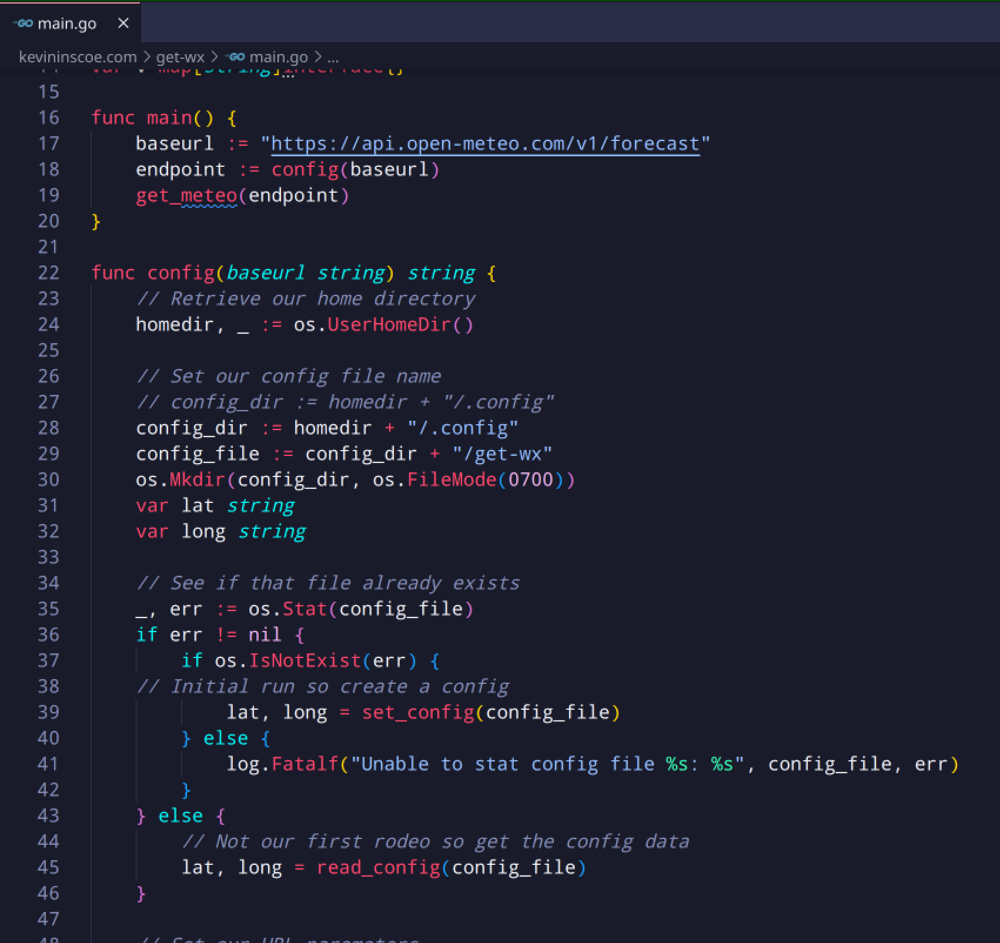

# Kevin Inscoe vscode settings

Here you will find my vscode settings that I use on two machines: MacOS and Fedora Linux broken into two sub-directories. /personal is Fedora and /professional being te Mac.

Settings are always being updated according to my needs, expediency and proficiency.

The settings are separated in the following topics:

- [Kevin Inscoe vscode settings](#kevin-inscoe-vscode-settings)
  - [Backup and synchronization of vscode settings](#backup-and-synchronization-of-vscode-settings)
  - [How does User settings work with this repo?](#how-does-user-settings-work-with-this-repo)
  - [Theme](#theme)
  - [Font-family](#font-family)
  - [Colors](#colors)
  - [Shell default](#shell-default)
  - [Extensions](#extensions)
  - [Some relevant settings](#some-relevant-settings)
    - [File saving mode](#file-saving-mode)
    - [Standard Extensions in Remote Container](#standard-extensions-in-remote-container)
    - [Copy on select](#copy-on-select)

## Backup and synchronization of vscode settings

I decided rather than sync between the machines which I could easily do I would put them here, A) so that I could review revisions I had made and B) share solutions I had found to others.

## How does User settings work with this repo?

In each directory is a copy.sh and a install.sh. I could have run a symlink from each live directory to the repo but I have had unforeseen and unexpected problems in the past doing this so I chose this compromise. I do the same with my dotfiles repo which is not public. 

I use copy.sh to copy the files from the live directory to the repo and install,sh to restore them from the repo (if need be). 

## Theme

Dank Neon Dark - https://marketplace.visualstudio.com/items?itemName=wuz.dank-neon



## Font-family

I use [JetBrains Mono](https://www.jetbrains.com/lp/mono/) as standard source.

Install it on your computer and activate it in the vscode by changing the `editor.fontFamily` option, for example:

```json
"editor.fontFamily": "\"JetBrains Mono\", 'Courier New', monospace",
````
Install:

- Fedora Linux 42: `sudo dnf install jetbrains-mono-fonts-all; sudo fc-cache -f -v
`
- Macos: `brew install --cask font-jetbrains-mono`
- Windows 11: Download from https://www.jetbrains.com/lp/mono/
  
## Colors

For workspace colors I use extension Window Colors - https://marketplace.visualstudio.com/items?itemName=stuart.unique-window-colors

For tab colors (only in Linux) I use Tabs color - https://marketplace.visualstudio.com/items?itemName=mondersky.tabscolor 

Tab color only works in Linux however because you have to have sudo as it writes to the install directory unless you install vscode in your home directory,

## Shell default

Diehard bourne-again-shell user so bash is my go-to.

For Linux and Mac I have a private repo of my bash files, perhaps someday I will put them publicly.

For Windows:

TBA but I don't work much shell in Windows except PowerShell.

## Extensions

My extensions can be easily installed by running:

```bash
wget https://raw.githubusercontent.com/kevinpinscoe/vscode-settings/refs/heads/main/extensions.txt
wget -O - https://raw.githubusercontent.com/kevinpinscoe/vscode-settings/refs/heads/main/install-extensions.sh | bash
````
See extensions.txt for the list

To uninstall all of the extensions (I did this to flush out older ones and then reinstall):

`code --list-extensions | xargs -n1 code --uninstall-extension`

## Some relevant settings

### File saving mode

Auto save is enabled permanently. 

To permanently enable autosave you can configure the files.autoSave setting in your user or workspace settings.

### Standard Extensions in Remote Container

Largely I use SSH to work in containers using the Remote - SSH extension https://marketplace.visualstudio.com/items?itemName=ms-vscode-remote.remote-ssh

If you use Remote Container to improve your environment with Docker set some standard extensions that will always be in the containers.

Go to Files -> Settings, search for `remote.containers.defaultExtensions` and add your default extensions to containers.

Mine are:

````
- 
- golang.go: https://marketplace.visualstudio.com/items?itemName=golang.Go
- xyz.local-history: https://marketplace.visualstudio.com/items?itemName=xyz.local-history
````

### Copy on select

I had gotten used to my terminal and some other apps automatically copying a selection
to the paste buffer however when I tried on vscode it turned out to be a horror show.

If I wanted to paste something in I would first select all in my current buffer and that in turn would replace what was in my paste buffer with what I just copied. Very frustrating. After thinking about it I realized this is actually hard to do in an editor versus some other app where are cutting and pasting. Until I figure out how to work around this I left it off but if you want to enable it:

`"terminal.integrated.copyOnSelection": true`

### Word wrapping and rulers

I use standard 70 characters ruler and wrap for Markdown and Text files.

```
  // Wrapping / Rulers
  "editor.rulers": [70],
  "editor.wordWrap": "wordWrapColumn",
  "editor.wordWrapColumn": 70,
  "[plaintext]": {
    "editor.wordWrap": "wordWrapColumn",
    "editor.wordWrapColumn": 70,
  },
  "[markdown]": {
    "editor.wordWrap": "wordWrapColumn",
    "editor.wordWrapColumn": 70,
  },
  ```

### Mermaid mindmap tasks

More on this in my https://github.com/kevinpinscoe/KnowledgeManagement repo.
